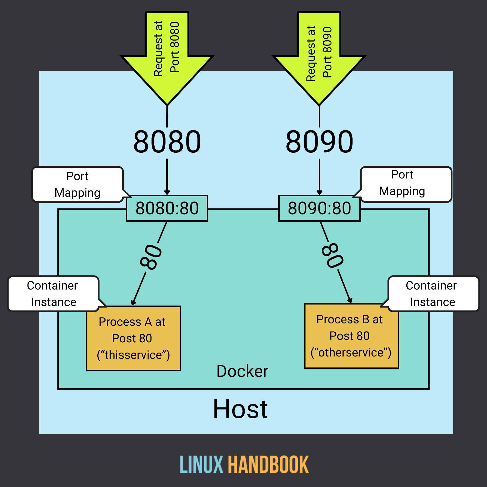
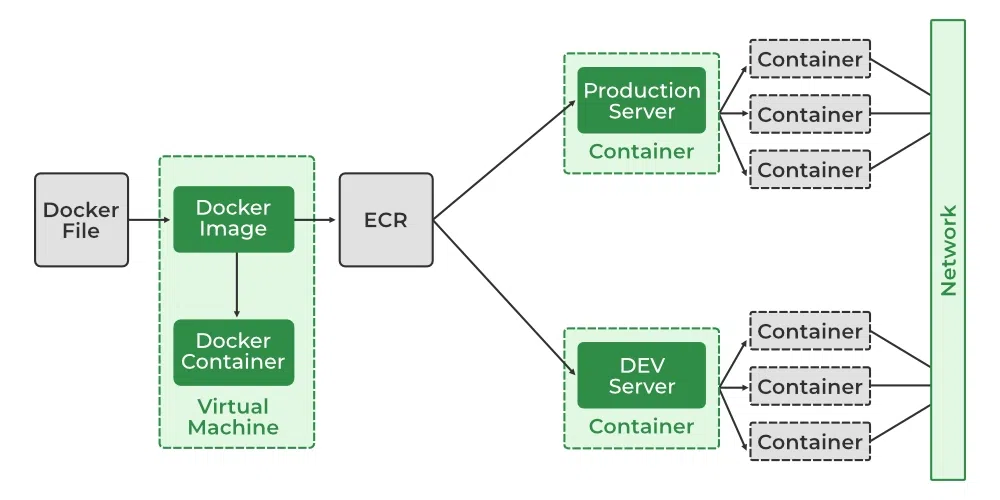
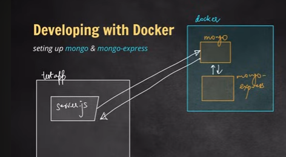
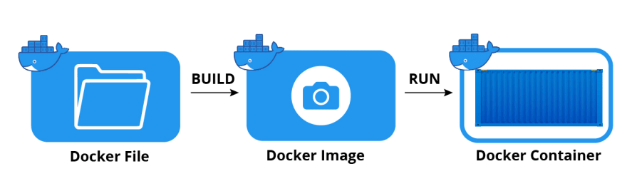

# docker-everything

docker helps us to build container. 

what is container?
it's a single package of (software+dependency)

what is docker image?
it's an executable file holds the instruction to build a container

The relation between docker image and container like the class and object.
inside a class there are objects similarly docker image is a executable file inside it there's docker images.

1) docker run -it ubuntu

it's like virtual machine but it's lightweight

#command---

docker ps 
docker ps -a
docker start 
docker stop
docker run

#Port Binding...

docker run -d -p 8000:3306 --name mymysql -e MYSQL_ROOT_PASSWORD=yourpassword mysql:latest

host mechine port with docker image port

#Troubleshoot Commands

🐳 Docker (Containers) vs 🖥️ Virtual Machines (VMs)
1. Architecture

VM

Runs a full guest operating system on top of a hypervisor.

Each VM includes its own kernel + OS + libraries + application.

Heavy in terms of resource usage (RAM, CPU, storage).

Docker (Container)

Shares the host OS kernel.

Only bundles the application + dependencies, not a full OS.

Much lighter and faster.

2. Resource Usage

VM → Heavyweight. Each VM might need GBs of disk space and minutes to boot.

Docker → Lightweight. A container might be MBs only, and starts in milliseconds.

#Docker Network

Docker networking is the system that allows Docker containers to communicate with each other, with the Docker host, and with the outside world. It's a powerful feature that enables you to build complex, multi-container applications that are isolated yet interconnected.

When you create a container, Docker gives it its own isolated network environment. This means each container has its own IP address and network interfaces. By default, containers running on the same host can communicate with each other without needing to expose ports to the host machine, creating a secure virtual network.

🔹 bridge (default)

Containers connect to a private internal network on the host.

Each container gets its own IP.

You can expose ports (-p host_port:container_port) to access from outside.
👉 Good for most standalone container use cases.

🔹 host

Removes the network isolation.

Container uses the host machine’s network stack directly.

No need for port mapping, because it shares host’s IP.
👉 Good for high-performance networking but less isolation.

🔹 none

No networking at all.

Container has only a loopback interface.
👉 Good for security/isolation when you don’t need networking.

#Mongo db setup...

docker run -d `
  -p 27017:27017 `
  --name mongo `
  --network mongo-network `
  -e MONGO_INITDB_ROOT_USERNAME=admin `
  -e MONGO_INITDB_ROOT_PASSWORD=qwerty `
  mongo

#Mongo-Express

In our local mechine there's no mongodb setup...our node js application still able
to connect with mongodb database that is running inside the container.

here node js application communicate with mongodb database ..and mongodb connected with mongodb express
in the same docker network, so they can communicate with each other.

#Docker Composer

Docker composer is a tool for defining and running multi-container applications.

we create .yaml file, there's instruction that which container my node.js application create and use.

to actually create yaml file from docker, we need docker composer.

docker compose -f fileName.yaml up -d
docker compose -f fileName.yaml down

-d (detached mode) → Runs containers in the background.
Without -d, logs of the containers would show up in your terminal.

docker compose -f mongo-express.yaml down
➡ Stops and removes both containers and the network created.

up -d: start everything
down: stop and remove everything.

in yaml file, we don't need to create any network, it automatically creates a network.

#run command for mongodb.yaml

docker compose -f mongodb.yaml up -d

#For data persistance we use volume in docker.

#dockerazing our own application

