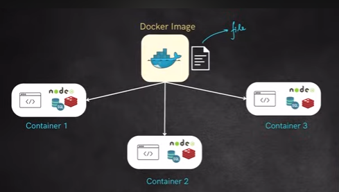

# docker-everything

docker helps us to build container. 

what is container?
it's a single package of (software+dependency)

what is docker image?
it's an executable file holds the instruction to build a container

